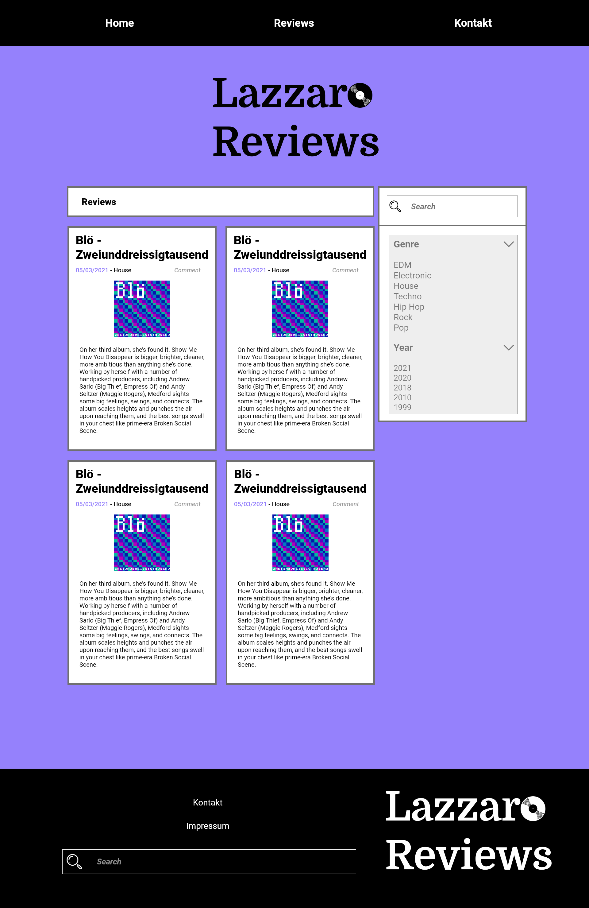
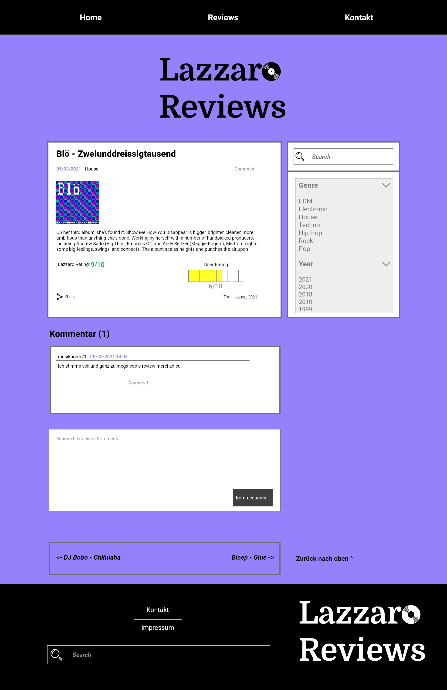
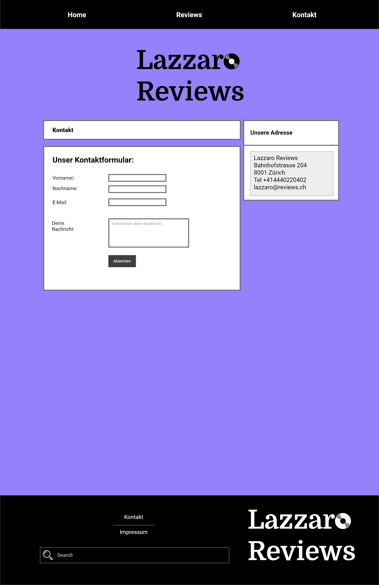
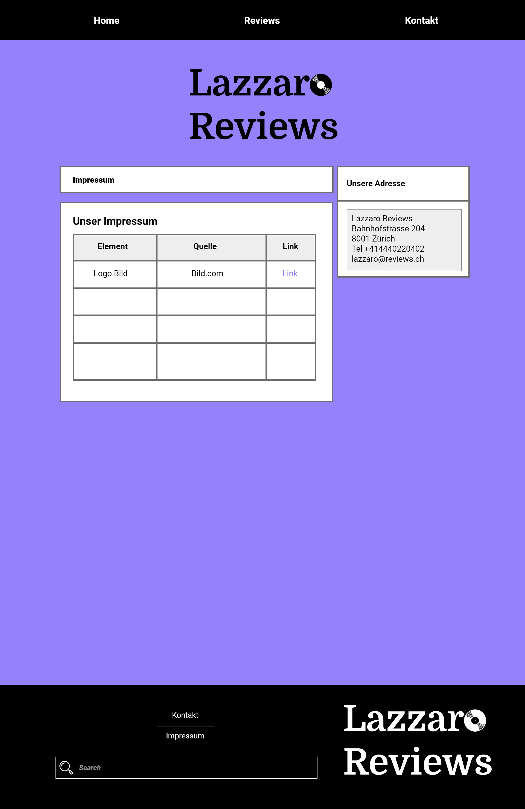
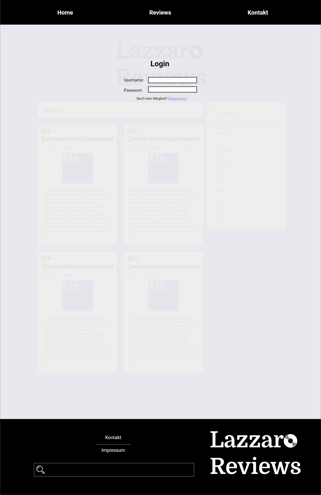
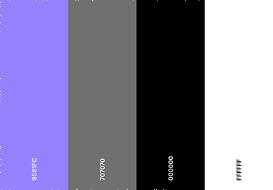
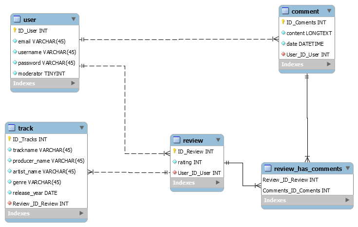

# Lazzaro Reviews

### Abstract
- Eine Musikdatenbank mit Bewertungen von Musikstücken  
- Die Bewertungen können kommentiert werden  
- User können selber eineBewertungenvon 1-10 Punktenhinterlassen 
- Eine Musikdatenbanksoll implementiert werden+ eine Benutzerdatenbank 
- Eine besondere Herausforderung wirddie Benutzerdatenbank mit dem Registrieren und Anmelden von Usern sein. 

### Zielgruppe
- 16 - 60 Jahre alt 
- Deutschsprechend 
- Deutschland, Schweiz, Österreich und andere deutschsprechenden Regionen  
- Technisch versiert sein  
- Musikliebhaber  
- Detailversessen  

### Mockups
####Home: 
####Reviews: 
####Kontakt: 
####Impressum: 
####Login: 
####Registration: 

### Farbkonzept
- Farbpalette: 
- Schrift: Roboto und Domine(Logo)
- Das Violet soll einen ruhigen und sanften Eindruck hinterlassen.  
- Die Review-Cards stechen mit ihrer weisen Fläche und schwarzem Rand aus.   
- Optionales wird dem Dunkelgrau in den Hintergrund geschoben.

### ERM
