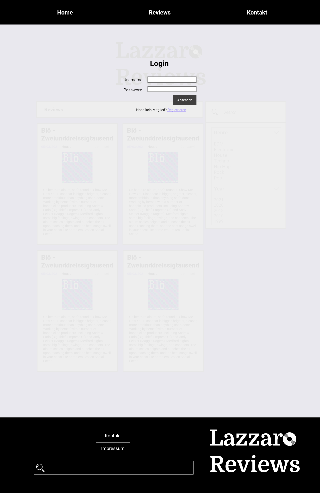
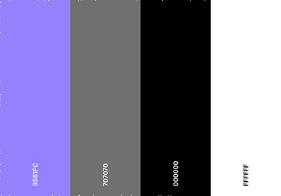
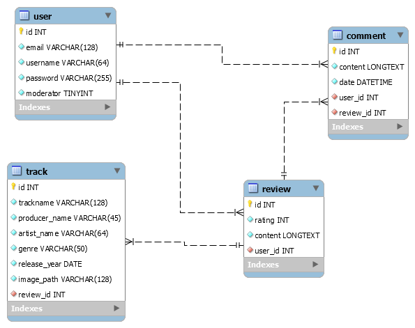

# Lazzaro Reviews

### Abstract
- Eine Musikdatenbank mit Bewertungen von Musikstücken  
- Die Bewertungen können kommentiert werden  
- User können selber eine Bewertungenvon 1-10 Punktenhinterlassen 
- Eine Musikdatenbanksoll implementiert werden+ eine Benutzerdatenbank 
- Eine besondere Herausforderung wird die Benutzerdatenbank mit dem Registrieren und Anmelden von Usern sein. 

### Zielgruppe
- 16 - 60 Jahre alt 
- Deutschsprechend 
- Deutschland, Schweiz, Österreich und andere deutschsprechenden Regionen  
- Kann einen Computer problemlos bedienen  
- Musikliebhaber  
- Detailversessen  

### Mockups
#### Home: 
#### Reviews: 
#### Kontakt: 
#### Impressum: 
#### Login: 
#### Registration: 

### Farbkonzept
- Farbpalette: 
- Schrift: Roboto und Domine(Logo)
- Das Violet soll einen ruhigen und sanften Eindruck hinterlassen.  
- Die Review-Cards stechen mit ihrer weisen Fläche und schwarzem Rand aus.   
- Optionales wird dem Dunkelgrau in den Hintergrund geschoben.

### ERM

### Unsere Systemkonfiguration

Version 0.1 auf dem Gitlab:  
- OS: Windows 10 Home 1909	 
- Browser: Google Chrome  Version 89.0.4389.114  
- Server:  
- Lokaler Apahce Server 
-- Apache Version 2.4.46  
-- PHP Version 8.0.2 
- HTML und CSS für statische Webiste
- Javascript für Clientseitige Validation
- SQL Sprache: Maria DB

### Fazit
Unser Projekt "Lazzaro Review" war sehr fordernd und wir (Samuel Hajnik und Raphael Blaauw) konnten viele Neues 
lernen zum Thema PHP, Datenbanken, Projektarbeit, MVC und allgemein Webapplikationen.   
Als Grundlage bauten wir eine statische Website nach unseren Mockups, was zu Beginn sicher der richtige
Ansatz war. Nach und nach ersetzten wir statischen Inhalt mit dynamischem via unserer Datenbank. Userdaten, die wir im 
"Abstract" noch als grosse Herausforderung werteten, konnten wir schnell auswerten und verwenden. Review- oder Trackdaten
waren anspruchsvoller anzusprechen und richtig zu verarbeiten. Mehrere Änderungen der Datenbankstruktur waren nötig um
die richtigen Attribute am richtigen Ort anzuzeigen. Kleine Stolpersteine wie diese kosteten uns viel Zeit. Im Endspurt 
entschieden wir uns daher für diverse User Stories als "Dropped Features" zu tagen, also auf diese für unseren aktuellen 
Release zu verzichten. So gewannen wir Zeit für verschieden Validierungsarbeiten und Testing, anstatt noch mehr Features
reinzupacken. Im Rückblick war das entscheidend um eine Webapplikation auf guten Niveau abgeben zu können. Der Fokus zum
Schluss war auf der User Experience, eng verbunden mit zahlreichen Tests.    
#### Abschliessend sind wir stolz auf unser Erstes realisierte Webapplikation. Die Zusammenarbeit war von Offenheit und Austausch geprägt und die Planung via Board auf Gitlab unterstützte unseren Projektalltag.
